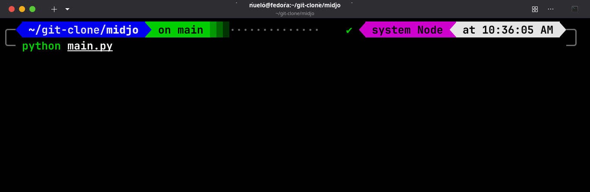

# MIDJO

> Midjo est une programme en ligne de commande écrit en full python qui permet de déterminer le coût d'un trajet avec un zemidjan (taxi-moto) ou avec un taxi (voiture) à Lomé

### Comment lancer ce programme ?
Lancer cette commande à la base dur projet

```bash
    python main.py
```

comme sur l'image ci-dessous


